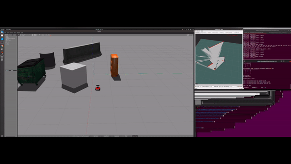

# Rosbot 

### Step-by-Step

Code From [husarion github](https://github.com/husarion/rosbot_description)




### 1. Preliminary

```
sudo apt-get install ros-noetic-teleop-twist-keyboard 
```

### 2. install husarion rosbot description

```
# DIR: ros/rosbot
rosdep install --from-paths src --ignore-src -r -y 
catkin_make
source devel/setup.sh
```

### 3. Use it!

There many launch files 

```
# terminal 1 : run simulator
# DIR: ros/rosbot/src/rosbot_husarion/src/rosbot_description/launch 
roslaunch <##.launch>

# terminal 2 : give operation
# DIR: ros/rosbot/src/rosbot_husarion/src/rosbot_navigation/launch
roslaunch rosbot_testop.launch
```

