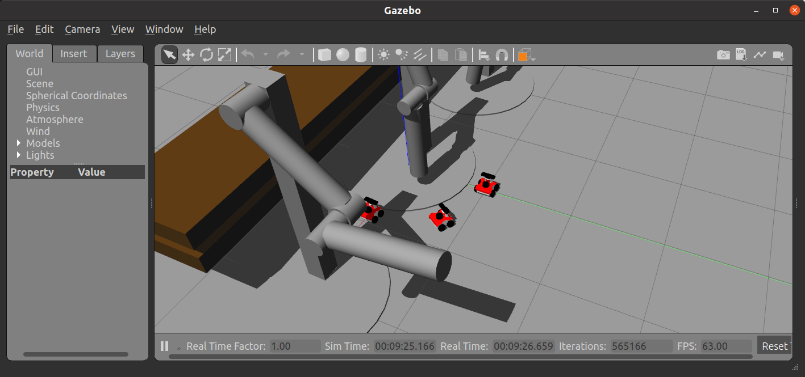

# Spawn Multiple Models

This tutorial describes how to make a world and three objects working in the world. 



Before you start, please build rosbot by `catkin_make` and run `source devel/setup.sh`. Because this launch files requires `rosbot_description` package. 


### 1. Launch Gazebo World
```
roslaunch world.launch 
```


### 2. Launch Multiple Spawns 

``` 
roslaunch multi_rosbot.launch
```


## Explanation 

* `modified_rosbot_gazebo` : it takes two arguments `position` and `rosbot_name` to separate the positions and names for all robots. Hence it spawn a single robot. 
* `multi_rosbot` : it calls `modified_rosbot_gazebo` multiple times with different initial positions and names. 


