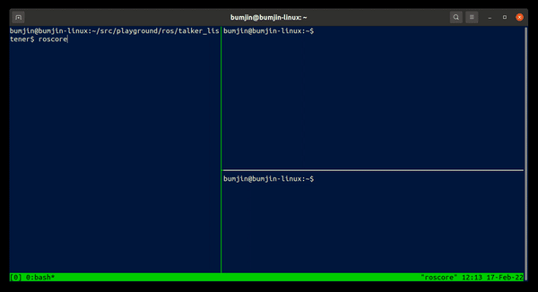

## Simple Listener and Talker Structure

Ready to run ROS + Python example 




```
# Make sure the ros is set. 
echo "source /opt/ros/noetic/setup.bash" >> ~/.bashrc

# ~/ros/talker_listner
catkin_make
echo  "source ~/ROS/ros_tutorials/talker_listener/devel/setup.sh" >> ~/.bashrc 

```

## Terminals
* Terminal 1 : `roscore`
* Termianl 2 : `rosrun pkg1 talker.py`
* Terminal 3 : `rosrun pkg1 numpy_listener.py` 
